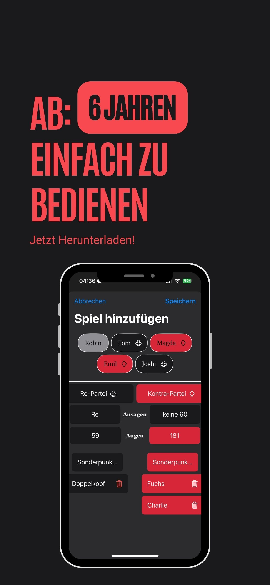

# Projekt DuempelKopf

## Beschreibung
Duempelkopf ist eine Liste zum Aufschreiben von Doppelkopf-Runden

## Features
- **Runden aufschreiben**: Runden mit bis zu 6-7 Spielern aufschreiben
- **Einfaches Design**: Nur das was du brauchst, kein schnickschnack!
- **Grafiken**: Visueller Rundenverlauf


## Anforderungen
- XCode (Swift)
- Git

## Entwicklung
1. Feature-Branch erstellen:
   ```sh
   git checkout -b feature-xyz
   ```
2. Änderungen vornehmen und committen:
   ```sh
   git commit -m "Feature xyz implementiert"
   ```
3. Änderungen in das Haupt-Repository pushen:
   ```sh
   git push origin feature-xyz
   ```
4. Pull-Request erstellen und Code-Review durchlaufen.

## Mitwirken
Wir freuen uns über Beiträge von der Community! Falls du Ideen oder Verbesserungsvorschläge hast, erstelle bitte ein Issue oder einen Pull-Request.

## Lizenz
Dieses Projekt steht unter der MIT-Lizenz. Weitere Informationen findest du in der Datei `LICENSE`.

## Kontakt
Für Fragen oder Feedback kannst du mich per E-Mail unter tom00408@aol.com erreichen oder ein Issue auf GitHub erstellen.

---
Vielen Dank für dein Interesse an Duempelkopf!

## Preview

<p align="center">
  
  
  
  
</p>
